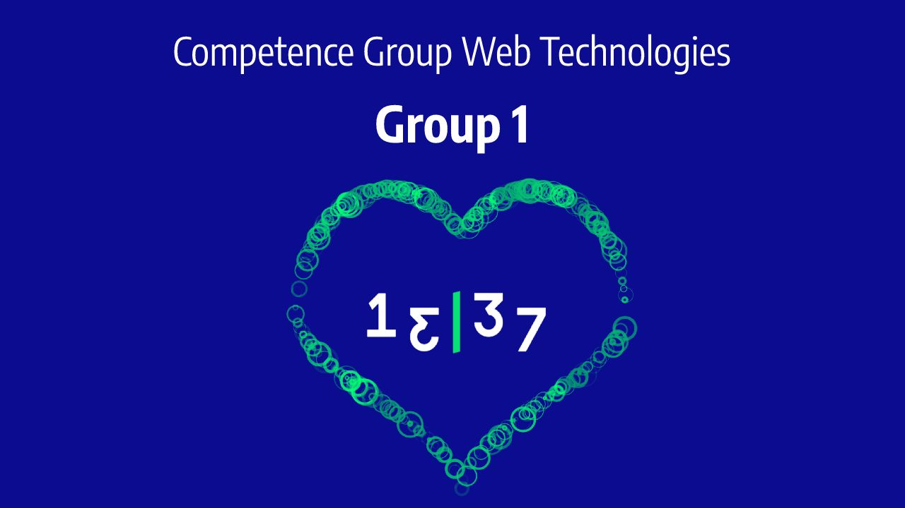

# Competence Group Web Technologies
## Ecosystems (former Web Architecture).

> **The main goal for this semester is to have a lot of fun, get to know each other and learn some new things on the way.**
> 
>Said by Mikael Borgbrant, and it was really fun and learning so much. Thank you, Mikael!

## What we will do
- A custom-made Single Page Application Framework
- Implement a simple ToDo-list application upon the framework
- Train ourselves in mob coding and discuss important design principles

## Features of the framework
### Required:
- JSX parsing
- State handling
- Manipulation of the DOM on state changes
- Custom components

### Optional:
- Server side rendering
- Support of contextual styling
- Conditional rendering

### Premium:
- Support for SVG in the JSX parsing (Good luck!)
- Global state handling

## Here is the roadmap to create a new front-end framework
### We had four 3-hour sessions.

- #### [Session 1](session-1.md)
- #### [Session 2](session-2.md)
